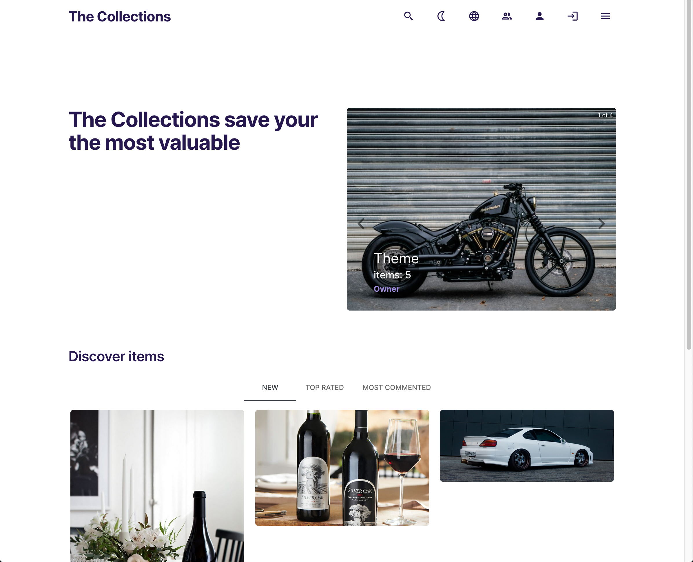

## Collections

it is a web-app for personal collections managements. It was made as a project for itransition internship.

[deploy link](https://collections-client.onrender.com/)

[backend repository](https://github.com/dmtrack/collections-server)

> **Attention!** The backend is deployed on a free service render.com, so when you run the application for the first time, you need to wait a little bit. Thank you ✊🏻

## Description

Nonauthenticated used have read-only access. Authenticated users have access to everythng except "admin area". Admin area give administators abilities to manage users.

Every user has a personal page, which allow to manage list of own collections (add/remove/edit). Collection can be managed (edit/add/remove) only by the owner (creator) or admin. Collection allows to define arbitrary number of custom fields, which will be filled for each item in this collection. The collection with all its items and custom fields can be exported to CSV-file.

Every page provides access to full-text search over whole site with items as a result, also you can filter items by tags.

Items can be commented by authenticated users, but any user (either authenticated or nonauthenticated) will see new comment immediately. Items have likes as well.

The app supports 2 languages: English and Russian and two visual themes - dark and light.

### Stack:

-   react
-   react-router
-   typescript
-   redux toolkit
-   web-sockets
-   node.js
-   postgreSQL (ORM: Sequelize)

## Styling:

-   tailwind
-   mui-icons

## Additional tools:

-   eslint
-   prettier
-   i18next
-   webpack

### Preview

