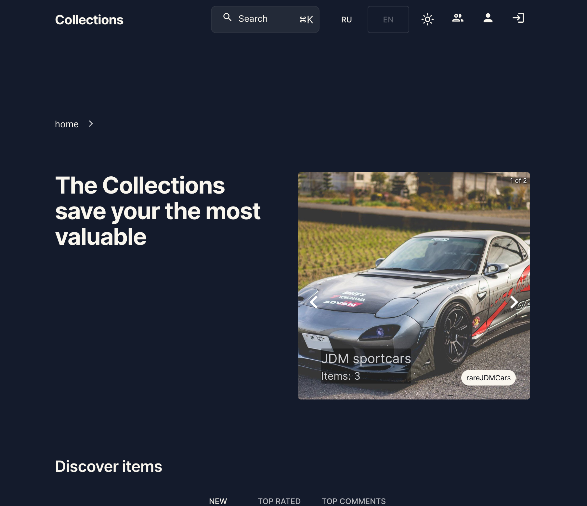
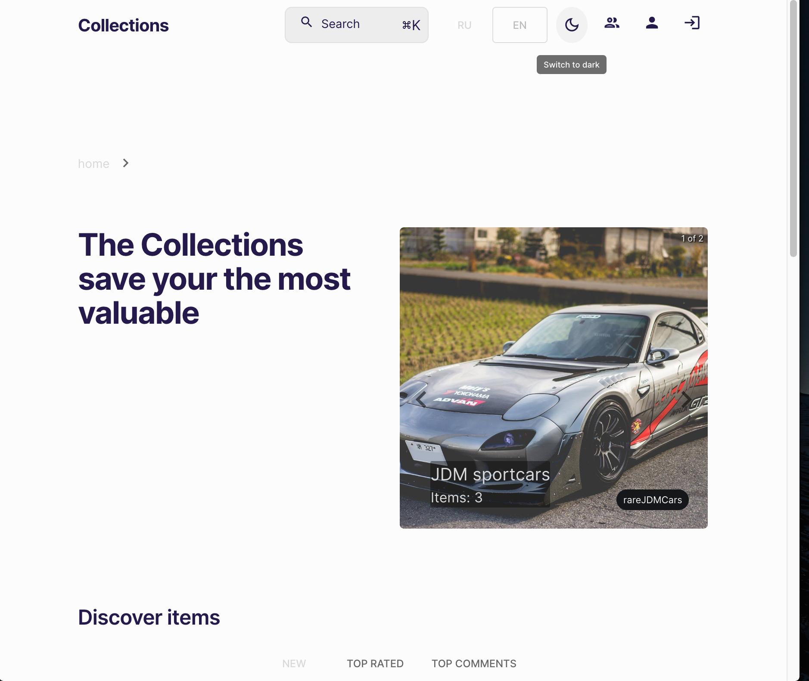
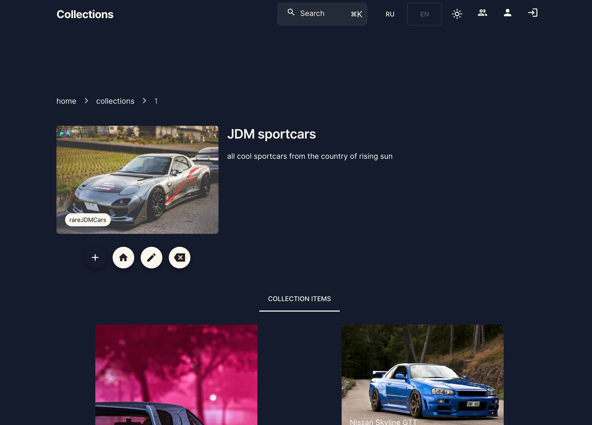

## Collections

it is a web-app for personal collections managements. It was made as a project for itransition internship.

[deploy link](https://collections-client.onrender.com/)

[backend repository](https://github.com/dmtrack/collections-server)

> **Attention!** The backend and data-base are deployed on a free service render.com, so when you run the application for the first time, you need to wait a little bit. Thank you ✊🏻

## Description

The collection has a name, description, picture, theme, list of items. The item consists of a name, tags, custom fields, likes and comments. When creating/editing a collection, you can define a list of fields that each item of the collection will have. The collection with all its items and fields can be exported to a CSV file. You can add comments and likes to each item, which will be immediately displayed to other users (using Websocket). An unauthenticated user has read-only access. Authenticated users have access to everything except the admin panel. In the admin panel, you can manage users: delete, block, assign administrators. The administrator can delete, add, edit any collections and items on behalf of the author. An authorized user can only manage their own collections and items. The list of the user's collections can be viewed in his profile. On the main page, you can view the last added items, filter them by tags, and view the most popular tags. You can also see collections sorted by the number of items and filter them by theme. You can register an account using email confirmation or using OAuth (GitHub, Google, Facebook). Full-text site search is available on each page. The app supports 2 languages: English and Russian, as well as two visual themes - dark and light. The app supports 2 languages: English and Russian and two visual themes - dark and light

## Preview

## Stack

### Frontend stack

-   react@18
-   react-router-dom@6
-   typescript
-   reduxjs/toolkit
-   meilisearch - full-text engine
-   socket-io - to display likes and comments
-   i18n
-   @sweet-monads/either - to convenient handling of exceptions and errors

### UI

-   mui/material
    mui/x-data-grid
    mui/x-date-pickers
    mui/icons-material
    mui-image
    toastify
-   react-tagcloud
-   react-instantsearch-dom

### Backend

-   nodeJS
-   typescript
-   express
-   sequelize (Postgres)
-   socket.io - to display likes and comments
-   meilisearch - full-text engine
-   jsonwebtoken
-   bcrypt
-   @sweet-monads/either - to convenient handling of exceptions and errors

### DB

-   postgreSQL (ORM: Sequelize)

## Endpoints

### Authorisation routes

    POST /user/registration - user's sign up
    POST /user/login - user's sign in
    POST /user/logout - user's logout
    POST /user/reconnect - reconnect
    GET /user/refresh - gets refresh tokens

### User routes

    GET /user/getusers - gets list of all users
    GET /user/getuser/:id - gets particular user
    PUT /user/block - block user's account
    PUT /user/unblock - unblock user's account
    DELETE /user/delete - deletes array of users
    DELETE /user/destroy/:id - deletes on user

### Profile routes

    POST /profile/confirm_edit - confirmation of the user's email when changing the profile (for logged-in users)
    POST /profile/edit_by_token - editing a profile by a token (for logged-in users)
    POST /profile/edit_by_provider - editing a profile using OAuth (for logged-in users)
    PATCH /profile/edit_avatar - editing a profile avatar (for logged-in users)
    GET /profile/:userId - get profile by id

### Admin routes (only for admins)

    GET /admin/users - get all users
    POST /admin/users/status - changing user status (blocked| deleted | active)
    POST /admin/users/admin_status - adding / removing administrators

### Collection routes

    POST /collection - creating a collection (for logged-in users)
    PATCH /collection - editing a collection (for logged-in users)
    DELETE /collection - deleting a collection (for logged-in users)
    GET /collection/:id - get collection by id
    GET /collection/next - get a range of collections (for lazy loading)
    GET /collection/themes - get all collection themes

### Item routes

    POST /item - creating an item (for logged-in users)
    PATCH /item - editing an item (for logged-in users)
    DELETE /item - deleting an item (for logged-in users)
    GET /item/:id - get item by id
    GET /item/next - get a range of items (for lazy loading)
    GET /item/tags - get all tags
    GET /item/popular_tags - get the 30 most popular tags

### Dev routes (only for developers)

    POST /dev/meilisearch_setup - set up the full-text engine (meilisearch)
    POST /dev/indexing/collections - indexing of all collections in the full-text engine
    POST /dev/indexing/items - indexing of all items in the full-text engine
    POST /dev/indexing/comments - indexing of all comments in the full-text engine
